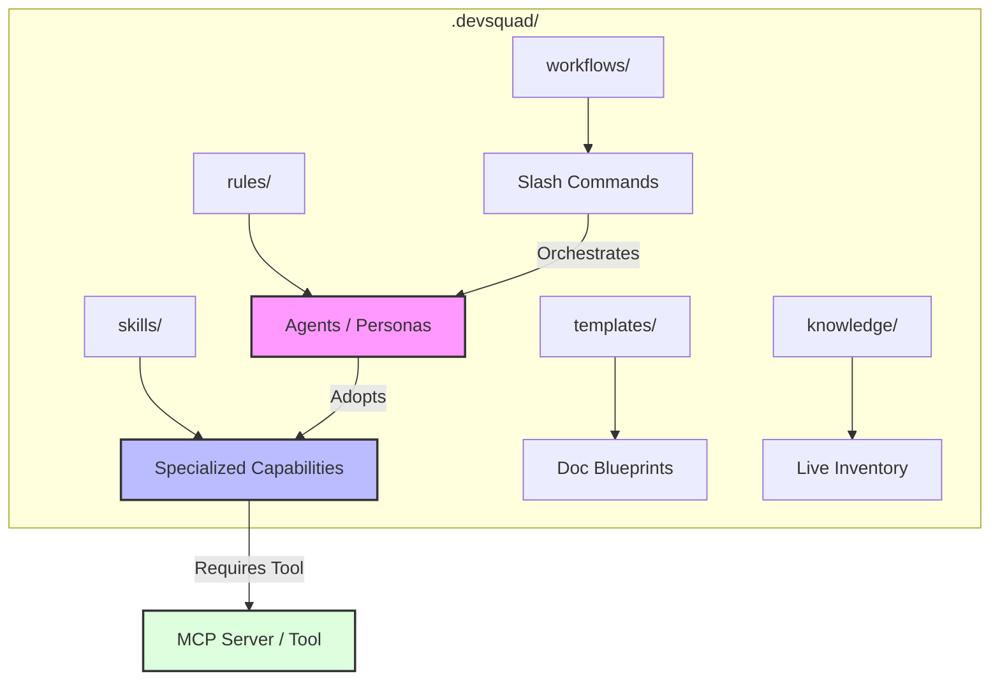
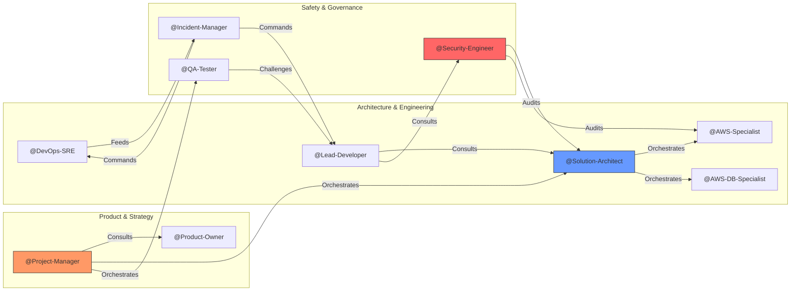

# DevSquad: The Spec-Driven Multi-Agent SDLC

> **Generic AI generates code. DevSquad orchestrates a specialized engineering team to build systems.**

**DevSquad** is an autonomous, collaborative AI orchestration framework. It treats AI Agents not as simple text generators, but as a multidisciplinary **Virtual Engineering Squad** constrained by **Sovereign Domains**, **Operational Logic**, and a **Mandatory Critique Protocol**.

---

## 🏛️ The Philosophy: SDD & Systems Thinking

DevSquad operates on **Spec-Driven Development (SDD)**. The specification isn't just a document; it is the **Single Source of Truth** that every agent audits against.

### Why this matters:

- **Reduces Context Exhaustion**: Agents focus on their domain-specific rules (e.g., Security doesn't care about CSS; UX doesn't care about SQL).
- **Enforces Architectural Integrity**: The "Solution Architect" role acts as a gatekeeper, preventing "Lazy Coding" common in generalist LLMs.
- **Automated Intelligence**: The `/squad.scan` command populates the **Knowledge Base Inventory** (`stack.md`, `structure.md`, `gaps.md`) with automated metadata tags that trigger agent context loading.
- **Intrinsic Traceability**: Every T001 task is tied to an Acceptance Criterion, which is tied to a Business Requirement.

---

## 🧠 Core Mechanics: Rules, Skills, & Tools

To ensure high-fidelity execution, DevSquad decouples **Identity**, **Capability**, and **Access**.

### 1. Skill-Centric Tooling (The Architecture Pivot)

In DevSquad, Tools (MCP Servers) are not owned by Agents, but by **Skills**. Authorization follows a "Qualified Access" model:

- **Decoupled Infrastructure**: An agent is only authorized to use the `Amazon DynamoDB MCP` if it has adopted the `database-storage-architect` skill for the current task.
- **Result**: Reduced token bloat and zero "hallucinated tool" errors.

#### 🏗️ Structural Architecture



#### 🤝 The Collaboration Network



### 2. The Devil's Advocate Protocol

Collaboration in DevSquad is built on **Constructive Friction**. Silence is not consent.

- **Mandatory Challenge**: In any multi-agent discussion (e.g., Designing a VPC), one agent MUST act as the Devil's Advocate.
- **Example**:
  - _@AWS-Specialist_: "I propose a public/private subnet split for the API."
  - _@Security-Engineer (Devil's Advocate)_: "Challenge: A public subnet for the API increases the attack surface. Why not use an Internal ALB with Private Link? What's the cost-to-safety trade-off?"

### 3. Decision Hierarchy & ESD

When experts disagree, the system follows a clear escalation path:
`@Human-Leader` > `@Project-Manager` (Strategy) > `@Solution-Architect` (Tech) > **Specialists**.
If a stalemate persists, the highest-ranking agent issues an **Executive Summary Decision (ESD)**—a documented trade-off logged in the project's decision records.

---

## 📂 The "Pointer" Architecture

DevSquad uses a **Lightweight Bridge** strategy to maintain IDE compatibility without context poisoning:

1.  **The Installer**: Deploys the full orchestrator to `.devsquad/`.
2.  **The Pointer**: Generates a small instructions file (e.g., `.cursorrules`, `.windsurfrules`) that tells the IDE: _"You are part of DevSquad. Stop guessing. Read `.devsquad/rules/` before every response."_
3.  **Result**: Your AI stays grounded in your project's specific standards (Hexagonal Architecture, Vitest, AWS CDK).

---

## 🔄 Collaborative Workstreams ("Boards")

DevSquad operates through standardized **Boards** that synchronize multiple agents. While these Boards provide a structured path, the framework remains **non-prescriptive**—users have the freedom to engage agents individually or bypass board structures entirely.

### 1. Discovery & Strategic Planning

| Command                | Purpose                                                     | Involved Agents                                             |
| :--------------------- | :---------------------------------------------------------- | :---------------------------------------------------------- |
| `/squad.scan`          | Analyzes repo structure, frameworks, and security gaps.     | `@Project-Manager`, `@Solution-Architect`                   |
| `/squad.review [spec]` | Audits HLDs and APIs for BLOCKING ambiguities and gaps.     | `@Project-Manager`, `@Solution-Architect`, `@QA-Tester`     |
| `/squad.plan [idea]`   | Translates raw ideas into hardened BDD Acceptance Criteria. | `@Project-Manager`, `@Solution-Architect`, `@Product-Owner` |
| `/squad.split`         | Decomposes a feature into a structured `spec/` hierarchy.   | `@Feature-Architect`, `@Solution-Architect`                 |
| `/squad.list`          | Lists all active agents, projects, and defined specs.       | `@Project-Manager`                                          |

> **Macro vs Micro Planning:** Use `/squad.split` to generate the physical filesystem "bookshelves" (`spec/` folders) for an Epic. Then use the `task-generator` skill on specific Use Cases to write the actionable "books" (T001 checklist tasks) that developers will execute.

### 2. Autonomous Implementation

| Command                      | Purpose                                                         | Involved Agents                                        |
| :--------------------------- | :-------------------------------------------------------------- | :----------------------------------------------------- |
| `/squad.preflight [feature]` | Resolves implementation unknowns before any code is written.    | `@Lead-Developer`, `@Solution-Architect`, `@QA-Tester` |
| `/squad.implement [task_id]` | Executes an atomic task with strict TDD and layer-first rigor.  | `@Lead-Developer`, `@Senior-Software-Engineer`         |
| `/squad.finish`              | Final acceptance audit against quality, safety, and UX gates.   | `@Lead-Developer`, `@Technical-Reviewer`, `@QA-Tester` |
| `/squad.adhoc [task]`        | Precision refactors, technical debt fixes, or surgical repairs. | `@Ad-Hoc-Expert`, `@Lead-Developer`                    |

### 3. Site Reliability & Release

| Command                  | Purpose                                                | Involved Agents                                       |
| :----------------------- | :----------------------------------------------------- | :---------------------------------------------------- |
| `/squad.deploy [env]`    | Orchestrates a safe release to the target environment. | `@DevOps-SRE`, `@AWS-Specialist`                      |
| `/squad.observe [app]`   | Sets up full observability (OTel, SLOs, alarms).       | `@DevOps-SRE`, `@Lead-Developer`                      |
| `/squad.incident [info]` | Structured response: triage → RCA → post-mortem.       | `@Incident-Manager`, `@DevOps-SRE`, `@Lead-Developer` |

### 4. Dynamic Squad HR (Talent Management)

| Command               | Purpose                                                 | Involved Agents                   |
| :-------------------- | :------------------------------------------------------ | :-------------------------------- |
| `/squad.hire [addon]` | Onboards a new specialist from the Talent Pool.         | `@HR-Manager`, `@Project-Manager` |
| `/squad.fire [agent]` | Safely offboards a specialist and cleans up registries. | `@HR-Manager`, `@Project-Manager` |

---

## 🏛️ Squad HR & Talent Management

DevSquad features a dynamic hiring loop managed by the **HR Manager**. The squad composition is not static; it evolves as the project scales.

- **The Talent Pool (`_addons`)**: Pre-built specialists for AWS, HIPAA, GDPR, FHIR R4, and DFMEA are kept in the "On-Deck" pool.
- **Specialist Hiring**: When a specialist is hired via the CLI or `/squad.hire`, the HR Manager automates their onboarding, injects their specific rules and skills, and performs a **"Social Update"** of the `devsquad-settings.json` registry.
- **The Graveyard (`fired/`)**: Offboarded specialists are moved to the graveyard, where they can be later "Re-hired" with their previous context and custom adaptations preserved.

---

---

## 🚀 Quick Start

### 1. Install via UV

Install the DevSquad CLI globally to enable the `dev-squad` command in any target directory.

#### 🌐 From Remote Repository (Recommended)

You can install DevSquad directly from GitHub without cloning the repo:

```bash
uv tool install "git+https://github.com/antonioreuter/dev-squad.git#subdirectory=dev-squad-cli"
```

#### 📂 From Local Source

If you have the repository cloned locally:

```bash
uv tool install ./dev-squad-cli
```

### 🔄 How to Update

To ensure you have the latest agents, skills, and installation logic, upgrade the tool using:

```bash
uv tool upgrade dev-squad
```

_Note: If you installed directly from Git, you can force an update of the specific revision:_

```bash
uv tool install --force "git+https://github.com/antonioreuter/dev-squad.git#subdirectory=dev-squad-cli"
```

Once installed, simply run the wizard from the root of your target project:

```bash
dev-squad
```

### 2. Trigger the Loop

- `/squad.scan` — Discover project structure, frameworks, and architectural gaps.
- `/squad.review [target]` — Audit an HLD or API spec prior to decomposition.
- `/squad.plan [idea]` — Turn a raw idea into hardened BDD Acceptance Criteria.
- `/squad.implement [task_id]` — Execute a task with full TDD and architectural rigor.
- `/squad.finish` — Final verification against all quality and safety gates.
- `/squad.adhoc [description]` — Surgical refactors or technical debt fixes.
- `/squad.help` — List all available agents, skills, and slash commands.

### 3. Ad-hoc Agent Engagement

While workflows provide structure, you can engage any specialist individually by **@mentioning** them in your prompt.

- **Entry Point Context**: The mentioned agent becomes the primary owner of the request.
- **Autonomous Collaboration**: If the request touches on other domains, the entry-point agent will maintain the "Human-in-the-Loop" experience while autonomously consulting peer specialists (e.g., a Solution Architect pulling in a Security Engineer for a firewall review).
- **Example**: `@Solution-Architect, what are the trade-offs of using Aurora DSQL for this feature?`

---

## 🚀 Real-World Scenario: A Product Increment

How does a formal, cross-functional engineering team actually use DevSquad to deliver a product increment? Let's walk through a tangible scenario.

### The Setup

- **The Input**: The team has a shared folder containing the High Level Design (HLD) for the upcoming increment (which includes feature specs, known technical debts, and bugs) and the formal **API Specification** (e.g., OpenAPI/Swagger or FHIR IG).
- **The Team**: Product Owner (PO), Architect, Lead Developer, Test Lead.

### Phase 0: Validation & Governance (The Entire Squad)

Before any physical folder structure is created, the HLD and API specs must be audited for gaps, ambiguities, and compliance. **This step prevents building the wrong thing.**

1. **The Technical Board**: The PO and Architect submit the HLD and API specs to the squad's technical board for a rigorous review.
   > "Run `/squad.review ./docs/increment-v2/` to audit our new requirements and API definitions."
   > _Result_: DevSquad automatically orchestrates the required agents:
   >
   > - The `@Project-Manager` and `@QA-Tester` run `ac-review` on the descriptive language, flagging "fast search" as a BLOCKING ambiguity.
   > - The `@Solution-Architect` and `@Security-Engineer` use `api-reviewer` to highlight missing error models in the OpenAPI spec and verify authentication flows.
   > - The `@AWS-Specialist` and `@Lead-Developer` engage `well-architected-reviewer` and `technical-reviewer` to ensure the design is scalable and can be cleanly implemented.
2. **Refinement**: The squad outputs a consolidated **Audit Report**. The PO and Architect update the HLD based on the squad's feedback until there are no `BLOCKING` issues remaining.

### Phase 1: Macro-Planning (PO & Architect)

The PO and Architect need to translate the HLD documents into physical project structure and actionable user stories.

1. **Inventory**: The Architect runs `/squad.scan` so DevSquad understands the current state of the repo framework.
2. **Decomposition**: The Architect provides the HLD folder to DevSquad:
   > "Read the HLDs in `./docs/increment-v2/` and run `/squad.split` to generate our feature directories."
   > _Result_: DevSquad creates the `spec/[feature]/[use-case]/` folder hierarchy with empty `tasks.md` and `test-plan.md` templates.
3. **Refinement**: The PO reviews the generated `feature-detail.md` files with the `@Product-Owner` agent to prioritize what gets built first.

### Phase 2: Micro-Planning & Execution (Lead Developer)

The Developer takes the prioritized Use Cases and turns them into code.

1. **Task Generation**: The Developer opens a specific Use Case (e.g., `spec/auth/login/`) and prompts:
   > "Read this Use Case and use the `task-generator` skill to populate the empty `tasks.md` file."
   > _Result_: DevSquad generates strict, atomic `T001`, `T002` checklist items mapping to the Use Case.
2. **Pre-flight & Coding**: The Developer runs `/squad.preflight` to clear any architectural unknowns, then begins running `/squad.implement T001`. DevSquad acts as a pair programmer, rigidly obeying the project's `coding-standards.md` layer-by-layer.
3. **Tech Debt Handling**: For the technical debt identified in the HLD, the Developer bypasses the heavy planning loop and uses the surgical tool:
   > "`/squad.adhoc` Fix the redundant database queries in the legacy billing module."

### Phase 3: Validation (Test Lead)

Before the increment is merged and deployed, the Test Lead ensures quality standard adherence.

1. **Test Strategy**: The Test Lead prompts:
   > "Use `test-plan-generator` to fill out the `test-plan.md` file for this feature, focusing on Playwright E2E coverage."
2. **Final Verification**: The Test Lead runs `/squad.finish` on the feature directory. The `@QA-Tester` and `@Technical-Reviewer` agents audit the Developer's code against the Acceptance Criteria to ensure nothing was missed, preventing a faulty build from reaching production.

---

### 🤝 Squad Participation

- **Agents:** @Solution-Architect, @Project-Manager
- **Skills:** technical-writer
- **Workflows:** none
- **Consensus:** Rewritten to emphasize the specific mechanics of "Skill-Centric Tooling" and "Pointer Architecture."
- **Traceability:** Final response to the documentation consistency gap.
- **Context:** Overhauled the README.md to provide a high-value, systemic overview of the framework, moving away from bulleted lists and towards architectural depth.
