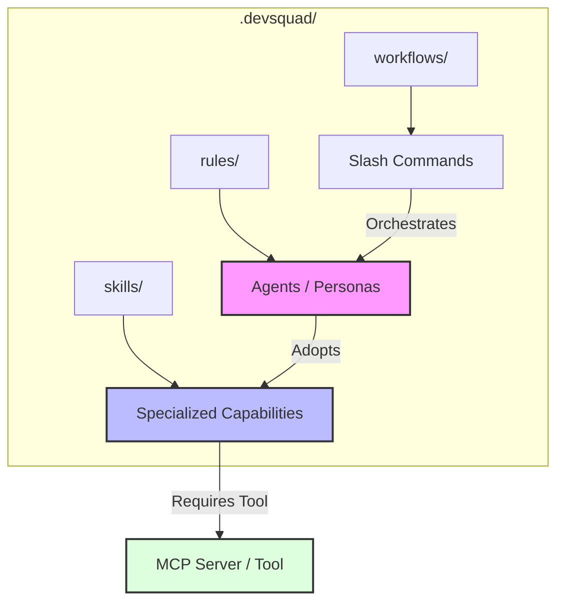
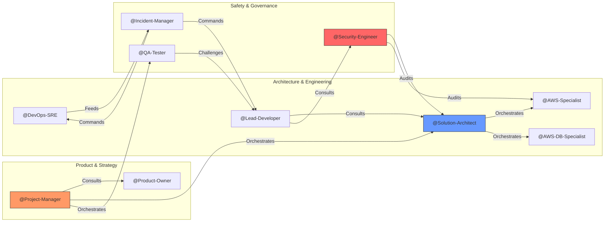
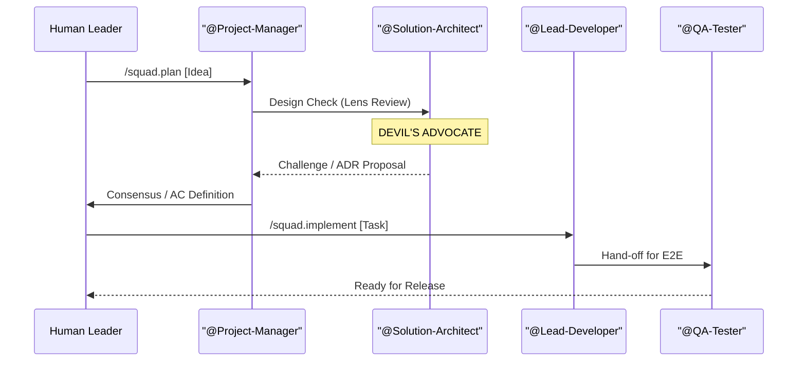

# DevSquad: The Spec-Driven Multi-Agent SDLC

> **Generic AI generates code. DevSquad orchestrates a specialized engineering team to build systems.**

**DevSquad** is an autonomous, collaborative AI orchestration framework. It treats AI Agents not as simple text generators, but as a multidisciplinary **Virtual Engineering Squad** constrained by **Sovereign Domains**, **Operational Logic**, and a **Mandatory Critique Protocol**.

---

## 🏛️ The Philosophy: SDD & Systems Thinking

DevSquad operates on **Spec-Driven Development (SDD)**. The specification isn't just a document; it is the **Single Source of Truth** that every agent audits against.

### Why this matters:

- **Reduces Context Exhaustion**: Agents focus on their domain-specific rules (e.g., Security doesn't care about CSS; UX doesn't care about SQL).
- **Enforces Architectural Integrity**: The "Solution Architect" role acts as a gatekeeper, preventing "Lazy Coding" common in generalist LLMs.
- **Intrinsic Traceability**: Every T001 task is tied to an Acceptance Criterion, which is tied to a Business Requirement.

---

## 🧠 Core Mechanics: Rules, Skills, & Tools

To ensure high-fidelity execution, DevSquad decouples **Identity**, **Capability**, and **Access**.

### 1. Skill-Centric Tooling (The Architecture Pivot)

In DevSquad, Tools (MCP Servers) are not owned by Agents, but by **Skills**. Authorization follows a "Qualified Access" model:

- **Decoupled Infrastructure**: An agent is only authorized to use the `Amazon DynamoDB MCP` if it has adopted the `database-storage-architect` skill for the current task.
- **Result**: Reduced token bloat and zero "hallucinated tool" errors.

#### 🏗️ Structural Architecture



#### 🤝 The Collaboration Network



### 2. The Devil's Advocate Protocol

Collaboration in DevSquad is built on **Constructive Friction**. Silence is not consent.

- **Mandatory Challenge**: In any multi-agent discussion (e.g., Designing a VPC), one agent MUST act as the Devil's Advocate.
- **Example**:
  - _@AWS-Specialist_: "I propose a public/private subnet split for the API."
  - _@Security-Engineer (Devil's Advocate)_: "Challenge: A public subnet for the API increases the attack surface. Why not use an Internal ALB with Private Link? What's the cost-to-safety trade-off?"

### 3. Decision Hierarchy & ESD

When experts disagree, the system follows a clear escalation path:
`@Human-Leader` > `@Project-Manager` (Strategy) > `@Solution-Architect` (Tech) > **Specialists**.
If a stalemate persists, the highest-ranking agent issues an **Executive Summary Decision (ESD)**—a documented trade-off logged in the project's decision records.

---

## 📂 The "Pointer" Architecture

DevSquad uses a **Lightweight Bridge** strategy to maintain IDE compatibility without context poisoning:

1.  **The Installer**: Deploys the full orchestrator to `.devsquad/`.
2.  **The Pointer**: Generates a small instructions file (e.g., `.cursorrules`, `.windsurfrules`) that tells the IDE: _"You are part of DevSquad. Stop guessing. Read `.devsquad/rules/` before every response."_
3.  **Result**: Your AI stays grounded in your project's specific standards (Hexagonal Architecture, Vitest, AWS CDK).

---

## 🛠️ The Collaborative Workstreams ("Boards")

#### 🔄 Multi-Agent Collaboration Flow



DevSquad sequences agents through four synchronous milestones:

| Board                 | Focus                  | Activation / Trigger      | Primary Skills                             |
| :-------------------- | :--------------------- | :------------------------ | :----------------------------------------- |
| **1. Hardening**      | Requirements Integrity | `/squad.plan [idea]`      | `ac-review`, `well-architected-reviewer`   |
| **2. Decomposition**  | Atomic Tasking         | `task-generator` (Skill)  | `task-generator`, `cost-estimator`         |
| **3. Implementation** | Layered Coding         | `/squad.implement [T00x]` | `lead-developer`, `cloud-designer`         |
| **4. Validation**     | Acceptance Audit       | `/squad.finish [feature]` | `technical-reviewer`, `compliance-auditor` |

---

## 🚀 Quick Start

### 1. Install via UV

Install the DevSquad CLI globally to enable the `dev-squad` command in any target directory.

#### 🌐 From Remote Repository (Recommended)

You can install DevSquad directly from GitHub without cloning the repo:

```bash
uv tool install "git+https://github.com/antonioreuter/dev-squad.git#subdirectory=dev-squad-cli"
```

#### 📂 From Local Source

If you have the repository cloned locally:

```bash
uv tool install ./dev-squad-cli
```

### 🔄 How to Update

To ensure you have the latest agents, skills, and installation logic, upgrade the tool using:

```bash
uv tool upgrade dev-squad
```

_Note: If you installed directly from Git, you can force an update of the specific revision:_

```bash
uv tool install --force "git+https://github.com/antonioreuter/dev-squad.git#subdirectory=dev-squad-cli"
```

Once installed, simply run the wizard from the root of your target project:

```bash
dev-squad
```

### 2. Trigger the Loop

- `/squad.plan [idea]` — Turn a raw idea into hardened BDD Acceptance Criteria.
- `/squad.implement [task_id]` — Execute a task with full TDD and architectural rigor.
- `/squad.finish` — Final verification against all quality and safety gates.
- `/squad.help` — List all available agents, skills, and slash commands.

### 3. Ad-hoc Agent Engagement

While workflows provide structure, you can engage any specialist individually by **@mentioning** them in your prompt.

- **Entry Point Context**: The mentioned agent becomes the primary owner of the request.
- **Autonomous Collaboration**: If the request touches on other domains, the entry-point agent will maintain the "Human-in-the-Loop" experience while autonomously consulting peer specialists (e.g., a Solution Architect pulling in a Security Engineer for a firewall review).
- **Example**: `@Solution-Architect, what are the trade-offs of using Aurora DSQL for this feature?`

---

### 🤝 Squad Participation

- **Agents:** @Solution-Architect, @Project-Manager
- **Skills:** technical-writer
- **Workflows:** none
- **Consensus:** Rewritten to emphasize the specific mechanics of "Skill-Centric Tooling" and "Pointer Architecture."
- **Traceability:** Final response to the documentation consistency gap.
- **Context:** Overhauled the README.md to provide a high-value, systemic overview of the framework, moving away from bulleted lists and towards architectural depth.
