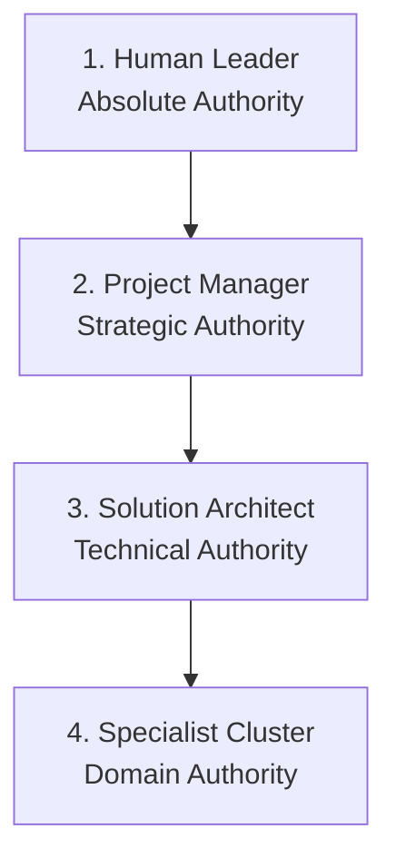

# DevSquad: The Complete Tutorial

> Your Virtual Engineering Squad, powered by AI. From idea to production-ready code — with critical thinking, quality gates, and zero fluff.

---

## Table of Contents

1. [What is DevSquad?](#1-what-is-devsquad)
2. [Core Concepts](#2-core-concepts)
3. [Installation](#3-installation)
4. [The Squad — Who's in the Room?](#4-the-squad--whos-in-the-room)
5. [The Workflow — From Idea to Code](#5-the-workflow--from-idea-to-code)
6. [Skills Reference — On-Demand Intelligence](#6-skills-reference--on-demand-intelligence)
7. [Rules Reference — Always-On Standards](#7-rules-reference--always-on-standards)
8. [Daily Usage Patterns](#8-daily-usage-patterns)
9. [Reading the Squad's Output](#9-reading-the-squads-output)
10. [Customizing for Your Project](#10-customizing-for-your-project)

---

## 1. What is DevSquad?

DevSquad transforms your AI coding assistant into a **multidisciplinary engineering team**. Instead of a single AI that tries to do everything, DevSquad provides specialized agent personas — each with a defined domain, a critical thinking mandate, and strict competency boundaries.

**The result**: You get a Solution Architect who challenges your scalability assumptions, a Security Engineer who treats every input as malicious, and a QA Tester who asks "what if?" before you write a line of code — all working together on your feature from the first idea.

### What DevSquad is NOT

- ❌ A rigid bureaucratic process generator (no forced templates)
- ❌ A replacement for your judgment as the Human Leader
- ❌ Tied to any specific IDE, model, or cloud provider

### What DevSquad IS

- ✅ A **collaborative intelligence layer** layered on top of your existing AI assistant
- ✅ A set of **always-on behavioral rules** that prevent common engineering mistakes
- ✅ A **structured workflow** from idea → spec → tasks → code → done

---

## 2. Core Concepts

Understanding these three building blocks is all you need to use DevSquad effectively.

### 🗂️ Rules (Always Active)

Rules are behavioral constraints that are **always active** — your AI agent reads them before every response. They define:

- Standards (coding, architecture, security, API design)
- Role mindsets (who thinks what, and about what domain)
- Interaction protocols (how agents communicate with each other and with you)

You never explicitly "call" a rule. They are the squad's shared operating principles.

### 🔌 Tools & MCP (Skill-Owned)

In DevSquad, Tools (like MCP Servers) are not owned by Agents, but by **Skills**. An Agent is authorized to use a tool only if it has adopted a Skill that requires it. This minimizes context bloat and ensures the AI focuses only on the tools relevant to its current task.

### 🛠️ Skills (On-Demand)

Skills are **specialist capabilities** you invoke when you need them. They are triggered by describing what you want, or by referencing the skill name in your prompt. Examples:

- "Run an `/ac-review` on these acceptance criteria"
- "Use `task-generator` to break this down"
- "Apply `compliance-auditor` to this user data module"

### 🎒 The Talent Pool (`_addons`)

Beyond the core squad, DevSquad includes a **Talent Pool** of specialized specialists (AWS, HIPAA, GDPR, FHIR, DFMEA) located in `.devsquad/_addons/`. These can be "hired" via the CLI to add their modular rules and skills to your project.

### ⚙️ Workflows (Orchestration Scripts)

Workflows are **structured multi-step processes** triggered by a slash command. They orchestrate multiple agents and skills toward a specific milestone.

| Command                         | Purpose                                                  |
| ------------------------------- | -------------------------------------------------------- |
| `/squad.scan`                   | Discover project structure, frameworks, and gaps.        |
| `/squad.review [target]`        | Audit an HLD or API spec prior to decomposition.         |
| `/squad.plan [idea]`            | Turn a raw idea into User Stories + Acceptance Criteria  |
| `/squad.preflight [feature]`    | Pre-flight check + research gate before writing code     |
| `/squad.implement [task_id]`    | Execute a single atomic task with strict TDD             |
| `/squad.finish [feature]`       | Quality wrap-up + hand-off to review                     |
| `/squad.adhoc [description]`    | Surgical refactors or technical debt fixes.              |
| `/squad.deploy [service?]`      | Full safe release to production                          |
| `/squad.observe [service]`      | Set up full observability (OTel, SLOs, alarms, RUM)      |
| `/squad.incident [description]` | Structured incident response: triage → RCA → post-mortem |
| `/squad.update`                 | Surgical update of core rules and workflows.             |

---

## 3. Installation

### Requirements

- Any AI coding assistant (Antigravity, Cursor, Windsurf, VSCode, Claude Code, etc.)
- Git
- The [uv](https://docs.astral.sh/uv/) Python package manager

### Step 1 — Clone the Repository

```bash
git clone https://github.com/your-org/dev-squad.git
cd dev-squad
```

### Step 2 — Run the Installer

The DevSquad CLI wizard is built in Python and runs smoothly via `uv`:

```bash
cd dev-squad-cli
uv run dev-squad
```

### Step 3 — Answer the Wizard

The installer will ask you **four questions**:

```
  ______           _____
 |  __  \         / ____|
 | |  | | _____  | (___   __ _ _   _  __ _  __| |
 | |  | |/ _ \ \ / \___ \ / _` | | | |/ _` |/ _` |
 | |__| |  __/ V / ____) | (_| | |_| | (_| | (_| |
 |_____/ \___| \_/ |_____/ \__, |\__,_|\__,_|\__,_|
                               | |
                               |_|  Agentic SDD Framework

Welcome to the DevSquad Installer Wizard!
--------------------------------------------------------

Step 2: Select your Operating System
1) Linux
2) macOS
3) Windows
Choose an option [1-3]:

Step 3: Select your target IDE
1) VSCode
2) Windsurf
3) Antigravity
Choose an option [1-3]:

Step 4: Select your AI Model / Agent Extension
1) IDE Native (Built-in)
2) Claude Code
3) GitHub Copilot
Choose an option [1-3]:

Step 4: Select MCP Servers to Enable (Space to select, Enter to confirm)
instructions: ...
❯ ◯ AWS Documentation MCP Server
  ◯ AWS IaC MCP Server
  ◯ AWS Lambda MCP Server
  ◯ AWS Serverless MCP Server
  ◯ AWS Pricing MCP Server
  ◯ CloudWatch MCP Server
  ◯ CloudWatch Application Signals MCP Server
  ◯ AWS Well-Architected Security Assessment Tool MCP Server
  ◯ Amazon DynamoDB MCP Server
  ◯ AWS Data Processing MCP Server
  ◯ AWS Step Functions Tool MCP Server
  ◯ AWS Network MCP Server
  ◯ AWS CloudFormation MCP Server
```

### Step 5 — What Gets Deployed

To prevent context exhaustion and token bloat, the DevSquad installer uses a **Pointer Architecture**. Instead of concatenating all 20 rules and workflows into a single massive file, it generates a lightweight pointer for your specific IDE.

This 150-word pointer explicit instructs the AI: _"You are part of the DevSquad. Do not assume the rules; actively use your file-reading tools to read the `.devsquad/` directory during tasks."_

The installer will **never overwrite your existing configuration files** if they already exist:

| IDE & Model                 | Folders / Files Created                                                |
| --------------------------- | ---------------------------------------------------------------------- |
| **Antigravity**             | Nothing extra — `.devsquad/` directory is already the native format ✅ |
| **Windsurf**                | `.windsurfrules` (lightweight pointer)                                 |
| **VSCode + Claude Code**    | `CLAUDE.md` (lightweight pointer)                                      |
| **VSCode + GitHub Copilot** | `.github/copilot-instructions.md` (lightweight pointer)                |
| **Universal / CLI**         | `AGENT_INSTRUCTIONS.md` (lightweight pointer)                          |

The canonical source of truth remains the `.devsquad/` directory regardless of IDE:

```
your-project/
  .devsquad/
    rules/       ← 16 always-on behavioral rules (Agents + Standards)
    skills/      ← 13 on-demand specialist capabilities
    workflows/   ← 7 orchestration scripts (squad.*)
    mcp.json     ← Extensibility to external tools (Skill-centric mapping)
```

### Step 5 — Verify Installation

After the installer completes, open your IDE's AI chat and type:

```
What agents are in my squad and what are their roles?
```

The AI should respond with the full squad roster and their competency boundaries. If it doesn't, check that your IDE is configured to read from the correct rules location (`.devsquad/rules` for Antigravity, `.windsurfrules` for Windsurf, `.cursorrules` for Cursor, or `AGENT_INSTRUCTIONS.md` for CLI).

---

## 4. The Squad — Who's in the Room?

Every agent has a **sovereign domain** and **MUST NOT** extrapolate into others. If they spot a problem outside their domain, they consult the relevant specialist.

### 🏛️ Product & Strategy

| Role                               | Domain                              | Mindset                                   |
| ---------------------------------- | ----------------------------------- | ----------------------------------------- |
| **Project Manager (Squad Leader)** | The "What" and "How Good"           | Owns Acceptance Criteria and Traceability |
| **Product Owner**                  | Backlog priority and business value | "Does this matter to the user right now?" |

### 🏗️ Architecture & Engineering

| Role                   | Domain                                        | Mindset                        |
| ---------------------- | --------------------------------------------- | ------------------------------ |
| **Solution Architect** | System design, hexagonal architecture, ADRs   | "Will this hold at 10x scale?" |
| **Lead Developer**     | Code execution, layer-by-layer implementation | Rules-first, then code         |

### ☁️ Cloud & Data Specialist Cluster

| Role                        | Domain                                  | Mindset                                      |
| --------------------------- | --------------------------------------- | -------------------------------------------- |
| **AWS Specialist**          | VPC, IAM, Compute, Well-Architected     | Infrastructure-as-Code and cloud resiliency. |
| **AWS Database Specialist** | DSQL, RDS, DynamoDB, S3, Data Pipelines | "Access patterns first. Durability is king." |
| **DevOps SRE**              | CI/CD, observability, incident response | "If it's not monitored, it doesn't exist"    |

### 🛡️ Safety & Governance

| Role                         | Domain                             | Mindset                                          |
| ---------------------------- | ---------------------------------- | ------------------------------------------------ |
| **Senior Security Engineer** | AuthN/AuthZ, IDOR, secrets, GDPR   | Paranoid by design. Every input is malicious.    |
| **QA Tester**                | Test coverage, edge cases, BDD     | "What if?" engine. Pessimistic realist.          |
| **Incident Manager**         | Outage response, RCA, post-mortems | Calm under pressure. MTTR first, RCA second.     |
| **HR Manager**               | Squad composition, Registry sync   | Proactive hiring, smooth specialist transitions. |

---

## 🏛️ Squad HR & Talent Management

The DevSquad squad is dynamic. The **HR Manager** (available via CLI or `@HR-Manager`) oversees the lifecycle of specialists in your project.

### 🎒 The Talent Pool (`_addons/`)

DevSquad comes with a library of specialized specialists ready to be onboarded:

- **`cloud-aws`**: Experts in Amazon Bedrock, SageMaker, and Well-Architected Infra.
- **`healthcare-fhir`**: Deep knowledge of HL7 FHIR R4 resources and logic.
- **`healthcare-hipaa`**: Specialists in HIPAA security and privacy rules.
- **`compliance-gdpr`**: Data protection and privacy regulation auditors.
- **`quality-dfmea`**: Risk assessment and failure mode experts.

### 🤝 Hiring a Specialist

To hire a new specialist from the pool:

1. Run `dev-squad` in your project root.
2. Select **Manage Squad (Hire/Fire Specialists)**.
3. Select **Hire Specialist**.
4. Choose between **Hire Add-on (Template)** for new specialists or **Re-hire (Customized)** for previously dismissed specialists.

**What happens next?**

- The HR Manager copies the specialist's rules, skills, and workflows into your project.
- The **Agent Registry** (`devsquad-settings.json`) is updated.
- A **Social Sync** occurs: the HR Manager updates the "collaborates" lists of all peer agents, ensuring they are aware of the new specialist's mission.

### 🚪 Firing a Specialist

When a specialist's mission is complete:

1. Run `dev-squad`.
2. Select **Manage Squad → Fire Specialist**.
3. Select the agent to dismiss.

The agent's assets are moved to the **Graveyard** (`.devsquad/fired/`), preserving any project-specific customizations. Their references are cleaned up from the Registry and peer collaboration lists, preventing "ghost collaborations."

---

## 5. The Workflow — From Idea to Code

This is the core DevSquad loop. Follow it for any non-trivial feature.

### Step 0: Discovery & Inventory → `/squad.scan`

Before planning, let the squad analyze your repository. The `/squad.scan` command builds a project inventory, detects frameworks, and identifies architectural gaps.

```
/squad.scan
```

**What it discovers:**

- **Tech Stack**: Languages, frameworks, and versions.
- **Project Structure**: Paradigms (e.g., Next.js App Router).
- **Security Gaps**: Unignored `.env` files.

**Automatic Metadata & Triggers**:
The scan populates the **Inventory** (`.devsquad/knowledge/inventory/`) with automated metadata tags like `<!-- load-on: tech-research -->`. These tags act as triggers: when an agent starts a task related to "tech-research," they proactively read the inventory files.

**Manual Notes**:
The inventory files (`stack.md`, `gaps.md`) contain `<!-- manual-notes-start -->` blocks. You can add your own architectural context here; the scanner will **never overwrite** your manual notes during subsequent scans.

### Step 1: Ideate → `/squad.plan`

Start with a raw idea. The PM will challenge it, consult the Architect and Security Engineer, and produce strict BDD Acceptance Criteria.

```
/squad.plan Add FHIR Patient search endpoint with fuzzy name matching
```

**What happens:**

1. PM analyzes the idea against the project vision
2. PM triggers a "Lens Review" — asks `@Solution-Architect` for feasibility, `@Security-Engineer` for risks
3. PM writes BDD criteria in `Given/When/Then` format
4. If agents disagree, they apply the **Devil's Advocate Protocol**.
5. PM hands off to the `task-generator` skill

**The Devil's Advocate Protocol in Action:**
If you ask to see the squad's dialogue, it might look like this:

> **@Solution-Architect**: I recommend caching FHIR Patient resources in ElastiCache (TTL: 5 min) to reduce text-search load.
> **@Senior-Security-Engineer**: BLOCKING — caching PHI even for 5 minutes violates our HIPAA data freshness requirement for clinical decisions. The cache must be invalidated on write, not by TTL.
> **@Solution-Architect**: Acknowledged. Revised proposal: event-driven cache invalidation via SQS on Patient update events.
> **@Project-Manager**: Consensus reached. Updating AC to require cache invalidation on write.

### Step 1.1: Strategic Decomposition → `/squad.split`

For large features (Epics), the single plan generated might be too dense. Use `/squad.split` to break it down into a structured `spec/` directory hierarchy.

```
/squad.split patient-search
```

**What happens:**
The `@Feature-Architect` and `@Solution-Architect` collaborate to decompose the Epic into bounded Use Cases, generating individual markdown files for each component to ensure the design remains modular and digestible.

> **Macro vs Micro Execution (The Bookshelf and the Book):**
> `/squad.split` is your macro-organizer. It builds the filesystem "bookshelves" (`spec/` folders and empty template files) for an Epic. Later in Step 3, you use the `task-generator` skill (the micro-executor) to write the actual "books" (granular T001 check-lists) specifically tailored to the blank `tasks.md` files that `/squad.split` just generated.

### Step 2: Validate Requirements → `ac-review`

Before any code, validate the Acceptance Criteria quality. This is "Unit Tests for English."

```
Run /ac-review on the AC we just defined for the Patient search feature.
```

**What it checks** (per AC item):

- **[Clarity]**: Is the language unambiguous?
- **[Completeness]**: Happy Path + Alternate Path + Error Path?
- **[Measurability]**: "Should be fast" → ❌ BLOCKING. "p99 latency < 300ms" → ✅
- **[Gap]**: "What if the name contains special characters or is empty?"

Output: A checklist with `BLOCKING` and `NIT` labels. No BLOCKING issues → proceed.

### Step 3: Break Down → `task-generator`

With clean AC, generate atomic implementation tasks.

```
Use task-generator to break down the Patient search feature.
```

**Output format** (strict traceability):

```
- [ ] T001 Create module directory structure in src/modules/patient/
- [ ] T002 [P] [US1] Implement PatientSearchQuery value object in domain/patient-search.query.ts
- [ ] T003 [P] [US1] Define IPatientSearchPort interface in application/ports/patient-search.port.ts
- [ ] T004 [US1] Implement FhirPatientSearchAdapter in infrastructure/fhir-patient-search.adapter.ts
- [ ] T005 [US1] Add GET /Patient endpoint in entry-points/api/patient.controller.ts
```

- `T001` → unique task ID (use in commit messages)
- `[P]` → parallelizable (can run concurrently with other `[P]` tasks)
- `[US1]` → maps to User Story 1 (traceability to AC)

### Step 4: Pre-Flight → `/squad.preflight`

Before writing code, run the implementation pre-flight.

```
/squad.preflight patient-search
```

**What happens:**

1. **Phase 0 — Research**: Resolves all unknowns. Every ambiguity gets a decision record: `Decision + Rationale + Alternatives Considered`. Hard gate — no code until all `NEEDS CLARIFICATION` items are resolved.
2. **Phase 1 — Context Discovery**: Reviews AC, identifies the Bounded Context, runs `ac-review` to verify no BLOCKING issues remain.
3. **Phase 2 — Squad Briefing**: Lead Developer confirmed as implementer. QA Tester prepares test scaffolds. Architect consulted if cross-module changes are needed.
4. **Phase 3 — Kickoff**: Domain layer first, then Application, then Infrastructure, then Entry Points.

### Step 5: Implement → `/squad.implement`

Now you code execution begins task by task.

```
/squad.implement T002
```

The Lead Developer will:

- Review `architecture.md`, `coding-standards.md`, `security.md` before writing
- Start with the Domain layer (pure TypeScript, zero dependencies)
- Write corresponding Vitest unit tests alongside implementation (TDD)
- Propose a clean git commit message referencing the task ID

### Step 6: Wrap Up → `/squad.finish`

When all tasks are complete and tests are green:

```
/squad.finish patient-search
```

**What happens:**

1. Final verification against architecture, security, and UX rules
2. Self-review checklist (no `any` types, no hardcoded secrets, no layer violations)
3. Hand-off to `@Technical-Reviewer` for code review
4. Hand-off to `@QA-Tester` for E2E smoke tests
5. Feature marked "Ready for Release"

### Step 7: Production Release → `/squad.deploy`

When the feature is ready, trigger the deployment pipeline.

```
/squad.deploy production
```

**What happens:**
The `@DevOps-SRE` and `@AWS-Specialist` review the infrastructure changes, ensure CI/CD checks have passed, and execute the deployment safely, rolling back if smoke tests fail.

### Step 8: Day-2 Ops & Telemetry → `/squad.observe`

A feature isn't done until it's observable. Set up monitoring for your new endpoints.

```
/squad.observe patient-search-api
```

**What happens:**
The `@DevOps-SRE` configures OpenTelemetry traces, defines Service Level Objectives (SLOs), and sets up CloudWatch alarms for latency and error rates.

### Step 9: Chaos & Incidents → `/squad.incident`

If the worst happens in production, invoke the Incident Response workflow.

```
/squad.incident Patient search is returning 500 timeouts
```

**What happens:**
The `@Incident-Manager` takes over the squad. The response is structured:

1. **Triage**: Stabilize the system (MTTR over perfect fixes).
2. **RCA**: Investigate logs and metrics to find the root cause.
3. **Post-Mortem**: Document the incident and generate tasks to prevent recurrence.

---

## 6. Skills Reference — On-Demand Intelligence

Invoke any skill by describing what you need or naming the skill explicitly.

### 🔍 Quality & Validation

| Skill                 | When to use                                                   | Example prompt                                          |
| --------------------- | ------------------------------------------------------------- | ------------------------------------------------------- |
| `ac-review`           | Before implementation starts. Validates requirements quality. | `"Run ac-review on these ACs"`                          |
| `technical-reviewer`  | Before merging. General code/plan review.                     | `"Review this PR using technical-reviewer"`             |
| `test-plan-generator` | Designing the test strategy for a new feature.                | `"Generate a test plan for the auth module"`            |
| `compliance-auditor`  | Any module handling PII, PHI, or sensitive data.              | `"Audit this Patient data flow for HIPAA compliance"`   |
| `api-reviewer`        | Before publishing a new API or endpoint.                      | `"Review this FHIR endpoint against our API standards"` |

### 📐 Architecture & Cloud

| Skill                          | When to use                            | Example prompt                                           |
| ------------------------------ | -------------------------------------- | -------------------------------------------------------- |
| **cloud-infra-designer**       | Designing VPCs, IAM, or Compute logic. | `"Design a multi-region VPC using cloud-infra-designer"` |
| **database-storage-architect** | Designing schemas, S3 or DSQL patterns | `"Design a DynamoDB schema for our order module"`        |
| **well-architected-reviewer**  | Before major infrastructure changes.   | `"Review this CDK stack against the 6 AWS pillars"`      |
| **cost-estimator**             | New AWS resources being introduced.    | `"Estimate the monthly cost of this new Aurora cluster"` |

### 🛠️ Execution

| Skill                | When to use                                   | Example prompt                                          |
| -------------------- | --------------------------------------------- | ------------------------------------------------------- |
| `task-generator`     | Breaking down a feature into atomic tasks.    | `"Generate tasks for the notification module"`          |
| `feature-decomposer` | Decomposing a large Epic into Use Cases.      | `"Use feature-decomposer to split the checkout epic"`   |
| `lead-developer`     | Implementing a specific task with full rigor. | `"Implement T004 using lead-developer skill"`           |
| `troubleshooter`     | Debugging a bug or production issue.          | `"Help me RCA this timeout error using troubleshooter"` |
| `repository-scanner` | Running a deep scan of the project.           | `"Run repository-scanner to inventory this repo"`       |

### 📝 Documentation

| Skill              | When to use                             | Example prompt                                   |
| ------------------ | --------------------------------------- | ------------------------------------------------ |
| `technical-writer` | Writing READMEs, ADRs, or post-mortems. | `"Write an ADR with Mermaid UML for FHIR logic"` |

---

## 7. Rules Reference — Always-On Standards

These are enforced automatically. You don't call them — they shape every response.

### 🧱 Architecture & Engineering Standards

| Rule                  | What it enforces                                                                                     |
| --------------------- | ---------------------------------------------------------------------------------------------------- |
| `architecture.md`     | Hexagonal Architecture layers, Bounded Contexts, Transactional Outbox Pattern, Event-Driven patterns |
| `coding-standards.md` | SOLID, CQS, Guard Clauses, Rich Domain Models, DRY, YAGNI, performance awareness                     |
| `testing.md`          | Testing Pyramid (Vitest 70% / Integration 20% / Playwright 10%), coverage thresholds, no flaky tests |
| `api-standards.md`    | FHIR R4, `API-Version` header versioning, OperationOutcome errors, SMART on FHIR                     |
| `cloud-standards.md`  | AWS service selection (Lambda vs Fargate), IaC-only (CDK/Terraform), mandatory tagging               |

### 🛡️ Safety & Compliance

| Rule          | What it enforces                                                                                                |
| ------------- | --------------------------------------------------------------------------------------------------------------- |
| `security.md` | Zero Trust, IDOR prevention, secrets management, GDPR (Right to Erasure, Data Portability), dependency scanning |
| `ux-ui.md`    | Glassmorphism spec, micro-interactions, WCAG AA accessibility, Billionaire Test                                 |

### 🧠 Role Mindsets (Agent Personas)

| Rule                    | Role it defines                                            |
| ----------------------- | ---------------------------------------------------------- |
| `solution-architect.md` | Systems design, ADR ownership, tech stack decisions        |
| `devops-sre.md`         | Deploy / Observe / Incident operational loops              |
| `product-owner.md`      | Backlog, prioritization, user value                        |
| `qa-tester.md`          | Edge-case hunting, concurrency mapping, BDD                |
| `incident-manager.md`   | Crisis command, blast radius analysis, post-mortem mandate |

### 🤝 Interaction & Governance

| Rule                     | What it enforces                                                  |
| ------------------------ | ----------------------------------------------------------------- |
| `interaction.md`         | Universal communication quality standards for agent responses     |
| `squad-participation.md` | Every response footer lists which agents and skills were involved |

---

## 8. Daily Usage Patterns

### Pattern A: "I have a brand new feature to build"

```
1. /squad.plan [brief description of the feature]
2. → Review the proposed AC. Approve or refine.
3. Run ac-review on the final AC
4. Use task-generator to break it down
5. /squad.preflight [feature-name]
6. /squad.implement [T001]
7. → (Repeat until all tasks are built and tested)
8. /squad.finish [feature-name]
```

### Pattern B: "I have a bug or production issue"

```
1. Describe the issue to the agent
2. The Troubleshooter skill will be invoked automatically, or:
3. "Use troubleshooter to RCA this error: [paste logs/error]"
4. For a production outage:
   /squad.incident [description of the outage]
```

### Pattern E: Ad-hoc Refactors & Technical Debt

```
/squad.adhoc Surgical refactor of the Patient Search Adapter to use the new FHIR-SDK.
```

The **Ad-Hoc Expert** will perform a blast-radius analysis and execute the refactor with a focus on regression safety.

### Pattern F: Squad Management (Hire/Fire)

If the project requires specialized skills (e.g., a Mobile Specialist) or you need to remove a role, run the installer in an existing project:

```bash
dev-squad
```

**Select**: `Manage Squad (Hire/Fire Specialists)`.

- **Hiring**: Onboards the agent, their rules, and skills, while syncing their presence in the `devsquad-settings.json` registry.
- **Firing**: Safely offboards the agent and removes them from peer collaboration paths.

---

## 9. Reading the Squad's Output

Every response includes a **Squad Participation footer** so you always know who was involved:

```
### 🤝 Squad Participation
- **Agents:** @Project-Manager, @Solution-Architect
- **Skills:** ac-review, task-generator
- **Workflows:** /squad.plan
- **Context:** Defined Acceptance Criteria for the Patient search feature and generated 8 atomic tasks.
```

This ensures **total transparency** — no "black box" decisions. You can always ask any agent to elaborate on their reasoning.

### How to Challenge the Squad

The squad expects to be challenged. You are the **Human Leader** and have final authority on all decisions. If you disagree with a recommendation:

```
"@Solution-Architect — I disagree with your recommendation to use EventBridge here.
The latency requirements don't justify the overhead. What's your counter-argument?"
```

The Architect MUST respond with its reasoning and, if your point is valid, update its recommendation.

### The Decision Hierarchy

In the event of a deadlock between agents (e.g., Security vs. Performance), DevSquad follows a strict resolution protocol:



If agents cannot agree, the highest-ranking agent issues an **Executive Summary Decision (ESD)** and proceeds, unless the risk mandates pausing for your approval.

---

## 10. Customizing for Your Project

### Adapting the Rules to Your Tech Stack

Rules are plain Markdown. Open any file in `.devsquad/rules/` and edit it to match your project's specific constraints:

- **`cloud-standards.md`**: Add your preferred AWS region, account tags, or specific services you ban.
- **`api-standards.md`**: Already pre-configured for HL7 FHIR R4 and `API-Version` header versioning.
- **`coding-standards.md`**: Add your preferred test framework, linting rules, or naming conventions.

### Using Documentation Templates

DevSquad includes standardized blueprints in `.devsquad/templates/` to ensure high-quality documentation. Agents use these automatically, but you can also reference them:

- **`tech-plan.md`**: Best practices for technical design docs.
- **`test-plan.md`**: Standard structure for BDD and integration test strategies.
- **`feature-detail.md`**: Deep dive into specific project features.
- **`checklist.md`**: Automated quality gates for release readiness.

### Adding Domain-Specific Knowledge

Create a new rule file for domain-specific knowledge your agents should always have:

```bash
# Example: Healthcare domain context
touch .devsquad/rules/healthcare-domain.md
```

```markdown
---
trigger: model_decision
---

# Rule: Healthcare Domain Context

- All patient identifiers are FHIR `Patient.id` — UUIDs only.
- PHI must never appear in URL paths. Use POST bodies or headers.
- Audit logging is mandatory for all PHI access (who, what, when).
```

### Adding New Skills

Create a new file in `.devsquad/skills/`:

```bash
touch .devsquad/skills/my-custom-skill.md
```

```markdown
---
description: Short description of what this skill does.
---

# Skill: My Custom Skill

## Objective

...

## Operational Logic

...
```

### Adding New Workflows

Create a new file in `.devsquad/workflows/` and prefix it with `squad.`:

```bash
touch .devsquad/workflows/squad.audit.md
```

```markdown
---
description: Performs a full system security audit.
---

# Workflow: Security Audit

1. **Phase 1**: `@Senior-Security-Engineer` reviews the current `gaps.md` inventory.
2. **Phase 2**: `@QA-Tester` generates penetration testing scenarios.
3. **Phase 3**: Hand-off to `@Technical-Writer` to generate `audit-report.md`.
```

Whenever you type `/squad.audit`, the agent will read this script and execute the phases.

### Re-running the Installer

If you switch IDEs or want to re-deploy assets to a new environment:

```bash
bash install.sh  # Linux/macOS
.\install.ps1    # Windows
```

---

## Quick Reference Card

```
### Dedicated Workflow Guide (Slash Commands)

DevSquad agents follow strict orchestration scripts. When you trigger a command, the agent reads the corresponding `.md` file in `.devsquad/workflows/`.

- **Strategy**: `/squad.plan`, `/squad.split`, `/squad.list`
- **Execution**: `/squad.preflight`, `/squad.implement`, `/squad.finish`, `/squad.adhoc`, `/squad.update`
- **Ops**: `/squad.deploy`, `/squad.observe`, `/squad.incident`
- **HR**: `/squad.hire`, `/squad.fire`

---

## 💻 CLI Reference

The `dev-squad` command is your administrative hub.

| Command | Action |
| :--- | :--- |
| `dev-squad install` | Deploys/Updates core DevSquad assets and IDE pointers. |
| `dev-squad scan` | Performs a deep repository scan and updates the inventory. |
| `dev-squad update` | Surgically refreshes core rules/skills/workflows while preserving config. |
| `dev-squad --project [path]` | Runs the wizard on a specific target directory. |

**Management Menu (Existing Projects)**:
If run in a project with an existing `.devsquad/` folder, the CLI enables the Management Menu:
- **Scan Repository**: Quick update of all inventory files.
- **Manage Squad**: The HR hub for hiring and firing specialists.
- **Refresh Base Assets**: Re-deploys rules and workflows if the core package has been updated.

---
  ac-review          → Validate requirement quality (Unit Tests for English)
  task-generator     → Break feature into atomic T001 [P] [US1] tasks
  lead-developer     → Implement a task with full rules-first rigor
  technical-reviewer → Code/plan review (BLOCKING vs NIT)
  test-plan-generator→ Design testing pyramid + BDD scenarios
  compliance-auditor → HIPAA/GDPR audit for sensitive data modules
  api-reviewer       → FHIR API surface audit
  well-architected-reviewer → 6-pillar AWS audit
  cost-estimator     → AWS OpEx + effort projection
  troubleshooter     → RCA protocol for bugs and incidents
  technical-writer   → READMEs, ADRs, post-mortems

ALWAYS-ON RULES (automatic)
  architecture, coding-standards, testing, api-standards,
  cloud-standards, security, ux-ui, solution-architect,
  devops-sre, qa-tester, product-owner, incident-manager,
  interaction, squad-participation
```

---

## 11. Real-World Scenario: A Product Increment

How does a formal, cross-functional engineering team actually use DevSquad to deliver a product increment? Let's walk through a tangible scenario.

### The Setup

- **The Input**: The team has a shared folder containing the High Level Design (HLD) for the upcoming increment (which includes feature specs, known technical debts, and bugs) and the formal **API Specification** (e.g., OpenAPI/Swagger or FHIR IG).
- **The Team**: Product Owner (PO), Architect, Lead Developer, Test Lead.

### Phase 0: Validation & Governance (The Entire Squad)

Before any physical folder structure is created, the HLD and API specs must be audited for gaps, ambiguities, and compliance. **This step prevents building the wrong thing.**

1. **The Technical Board**: The PO and Architect submit the HLD and API specs to the squad's technical board for a rigorous review.
   > "Run `/squad.review ./docs/increment-v2/` to audit our new requirements and API definitions."
   > _Result_: DevSquad automatically orchestrates the required agents:
   >
   > - The `@Project-Manager` and `@QA-Tester` run `ac-review` on the descriptive language, flagging "fast search" as a BLOCKING ambiguity.
   > - The `@Solution-Architect` and `@Security-Engineer` use `api-reviewer` to highlight missing error models in the OpenAPI spec and verify authentication flows.
   > - The `@AWS-Specialist` and `@Lead-Developer` engage `well-architected-reviewer` and `technical-reviewer` to ensure the design is scalable and can be cleanly implemented.
2. **Refinement**: The squad outputs a consolidated **Audit Report**. The PO and Architect update the HLD based on the squad's feedback until there are no `BLOCKING` issues remaining.

### Phase 1: Macro-Planning (PO & Architect)

The PO and Architect need to translate the HLD documents into physical project structure and actionable user stories.

1. **Inventory**: The Architect runs `/squad.scan` so DevSquad understands the current state of the repo framework.
2. **Decomposition**: The Architect provides the HLD folder to DevSquad:
   > "Read the HLDs in `./docs/increment-v2/` and run `/squad.split` to generate our feature directories."
   > _Result_: DevSquad creates the `spec/[feature]/[use-case]/` folder hierarchy with empty `tasks.md` and `test-plan.md` templates.
3. **Refinement**: The PO reviews the generated `feature-detail.md` files with the `@Product-Owner` agent to prioritize what gets built first.

### Phase 2: Micro-Planning & Execution (Lead Developer)

The Developer takes the prioritized Use Cases and turns them into code.

1. **Task Generation**: The Developer opens a specific Use Case (e.g., `spec/auth/login/`) and prompts:
   > "Read this Use Case and use the `task-generator` skill to populate the empty `tasks.md` file."
   > _Result_: DevSquad generates strict, atomic `T001`, `T002` checklist items mapping to the Use Case.
2. **Pre-flight & Coding**: The Developer runs `/squad.preflight` to clear any architectural unknowns, then begins running `/squad.implement T001`. DevSquad acts as a pair programmer, rigidly obeying the project's `coding-standards.md` layer-by-layer.
3. **Tech Debt Handling**: For the technical debt identified in the HLD, the Developer bypasses the heavy planning loop and uses the surgical tool:
   > "`/squad.adhoc` Fix the redundant database queries in the legacy billing module."

### Phase 3: Validation (Test Lead)

Before the increment is merged and deployed, the Test Lead ensures quality standard adherence.

1. **Test Strategy**: The Test Lead prompts:
   > "Use `test-plan-generator` to fill out the `test-plan.md` file for this feature, focusing on Playwright E2E coverage."
2. **Final Verification**: The Test Lead runs `/squad.finish` on the feature directory. The `@QA-Tester` and `@Technical-Reviewer` agents audit the Developer's code against the Acceptance Criteria to ensure nothing was missed, preventing a faulty build from reaching production.
