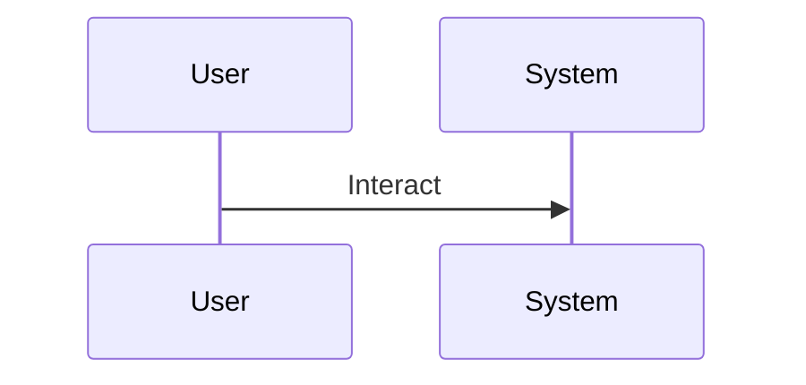

# Feature Specification: [FEATURE NAME]

## 1. Goal & Vision

[A concise summary of the primary objective and the value this feature provides.]

## 2. Success Criteria (Measurable Outcomes)

- **SC-001**: [e.g., "Users can complete account creation in under 2 minutes"]
- **SC-002**: [e.g., "System handles 1000 concurrent users without degradation"]

## 3. Prioritized User Stories

<!--
  Prioritize as user journeys (P1, P2, P3).
  Each story must be INDEPENDENTLY TESTABLE as a standalone slice of value.
-->

### [US1] [Title] (Priority: P1 - MVP)

- **Description**: [Plain language journey]
- **Value**: [Business/User impact]
- **Independent Test**: [Specific action/demonstration to verify this story works on its own]
- **Acceptance Scenarios (BDD)**:
  - **Given** [state], **When** [action], **Then** [outcome]

### [US2] [Title] (Priority: P2)

- **Description**: [Next iteration journey]
- **Acceptance Scenarios**:
  - **Given** [state], **When** [action], **Then** [outcome]

## 4. Functional Requirements (FR-xxx)

- **FR-001**: System MUST [specific capability]
- **FR-002**: System MUST [behavioral constraint]

## 5. Key Entities & Data Model

- **[Entity Name]**: [Representative attributes and relationships]

## 6. Architecture & Logic Diagrams

### Sequence Diagram (UML)

## 7. Constraints & Assumptions

- **Constraint**: [e.g. Offline-capable]
- **Assumption**: [e.g. Legacy API v1 is decommissioned]
