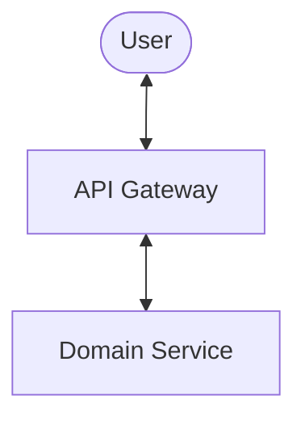
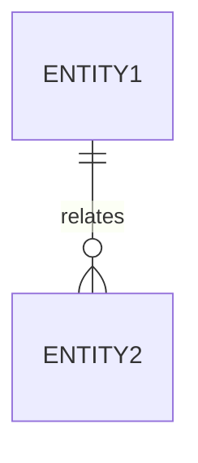

# Implementation Plan: [FEATURE NAME]

## 1. Technical Context

| Attribute                | Resource / Choice           |
| :----------------------- | :-------------------------- |
| **Language/Version**     | [e.g., Node.js 18]          |
| **Primary Dependencies** | [e.g., Prisma, Next.js]     |
| **Storage / DB**         | [e.g., PostgreSQL]          |
| **Target Platform**      | [e.g., Linux / Vercel]      |
| **Performance Goals**    | [e.g., < 200ms p95 latency] |

## 2. Architecture & Design Decisions

[High-level overview of the technical approach.]

### System Architecture

## 3. Complexity Tracking & Justification

> **Justify architectural overhead here**

| Decision             | Why Needed                 | Alternative Rejected Because      |
| :------------------- | :------------------------- | :-------------------------------- |
| [e.g., Saga Pattern] | [Distributed transactions] | [TCC was too complex to maintain] |

## 4. Data Model (Schema UML)

## 5. Risks & Mitigations

- **Risk**: [Description]
- **Mitigation**: [Action]

## 6. Verification Strategy

- [ ] **Unit**: [Logic/Domain]
- [ ] **Integration**: [Adapters]
- [ ] **E2E**: [User flows]
