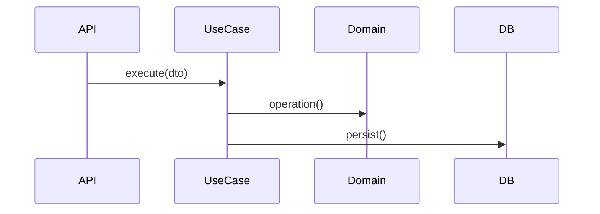
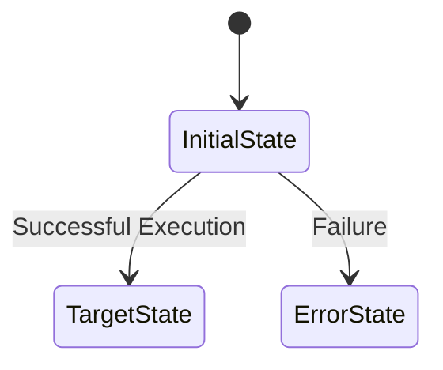

# Use Case: [Use Case Name]

> [!NOTE]
> Only fill in the sections that are relevant to this specific use case. Unused sections can be removed.

## 1. Context & Goal

[Why this use case exists and what it aims to achieve.]

## 2. Requirements Traceability

[List of high-level requirements or User Stories addressed by this use case.]

## 3. Actors & Authorization

- **Primary Actor**: [User Role]
- **Authorization**: [Specific permissions or roles required, e.g., 'admin', 'write:orders']

## 4. Acceptance Criteria (BDD)

- **Given** [Context]
- **When** [Action]
- **Then** [Outcome]

## 5. Input / Output Contract

- **Input**: `[Request DTO or Field List]`
- **Output**: `[Response DTO or Success Event]`

## 6. Business Rules & Constraints

- [Rule 1]: [Description]
- [Rule 2]: [Description]

## 7. Main Flow (Happy Path)

1. [Step 1]
2. [Step 2]

### Interaction Diagram (UML)

## 8. Alternate & Error Flows

- [Scenario A]: [Logic to handle]

## 9. State Transitions (UML)

